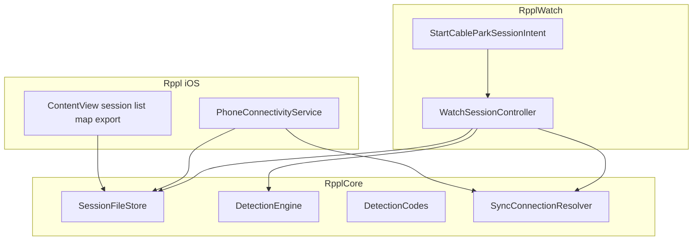
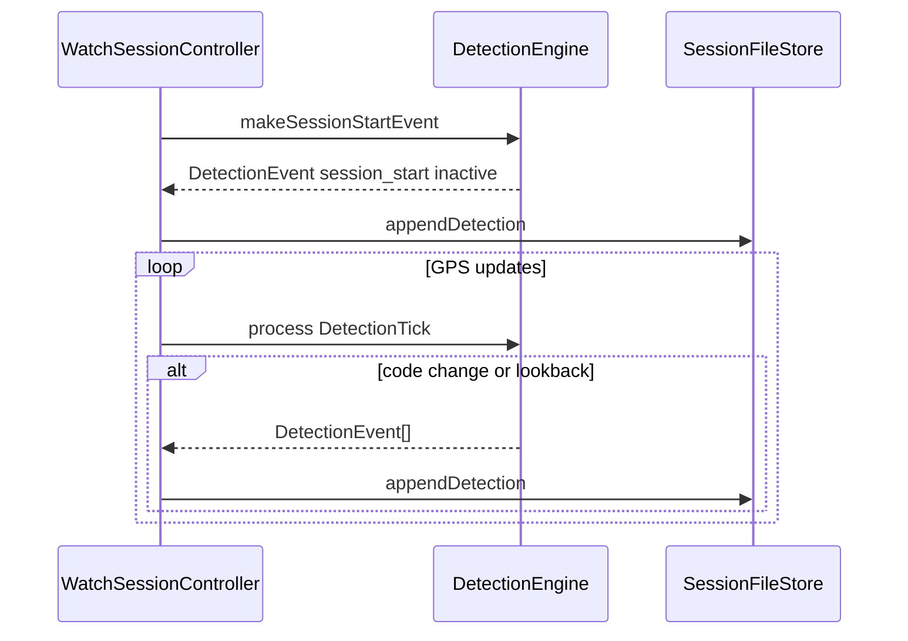

# System design

How Watch, iPhone, and `RpplCore` fit together. Library internals (DetectionEngine UML, store types): [../RpplCore/DESIGN.md](../RpplCore/DESIGN.md). Product lock: [../README.md](../README.md).

## Layers

| Layer | Own | Avoid |
|-------|-----|--------|
| `RpplCore` | Models, schema, file store, DetectionEngine, sync *wording* resolvers | UIKit/SwiftUI, WCSession, HealthKit, CoreLocation |
| `RpplWatch` | `HKWorkoutSession` + Health save, sensors, StartWorkoutIntent, WC send, thin probes into Core | Business decision trees that can be pure functions |
| `Rppl` | Permissions, WC receive/ack, session list/map/export | Session engine, label editing |

Apps read live `WCSession` / sensors, then call Core. Do not duplicate detection or sync decision trees in both targets.

## Detection stream

- **Detections:** `detections.jsonl` (transitions + `session_start` + lookback revisions; km/h `reason`).
- Codes: `riding` / `inactive` / `unsure`.
- Manual labels removed.

Streams detail: [DataCollection.md](DataCollection.md). Thresholds: [Phase3.md](Phase3.md).

## Hard constraints (unchanged)

1. HealthKit save — `stopActivity` → wait `.stopped` → `endCollection` → `finishWorkout()` → `session.end()`; mirror HR/energy into JSONL; keep HK session running during detection rest (motion events + disable ride-metric collection); **`session.pause()` only for product Pause** (also halts sensors).
2. Never delete Watch session files until phone ack.
3. One continuous session per park day by default; product Pause allowed (sensor gap + frozen clock; ≠ detection `inactive`).
4. Detection codes stay opaque strings.
5. iPhone view-only — no label editor.
6. OS floor iOS 26+ / watchOS 26+.
7. Water Lock on session start.
