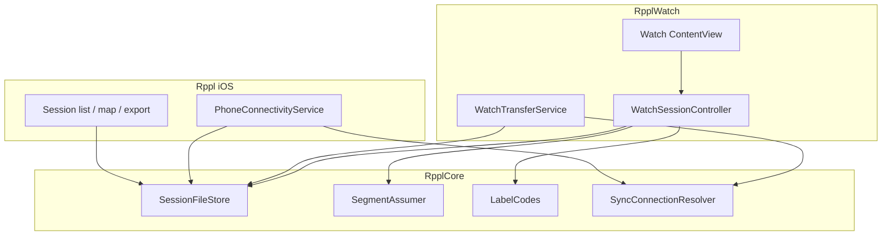
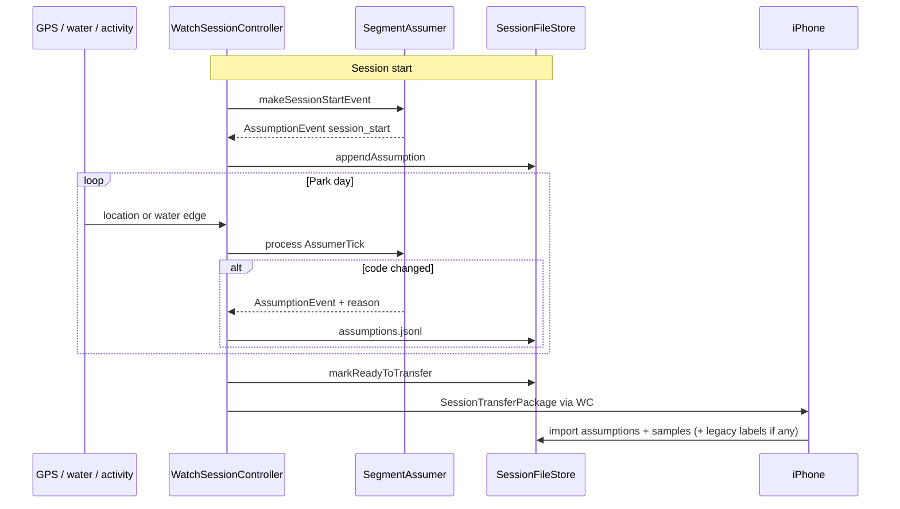

# System design

How Watch, iPhone, and `RpplCore` fit together. Library internals (Assumer UML, store types): [../RpplCore/DESIGN.md](../RpplCore/DESIGN.md). Product lock: [../README.md](../README.md).

## Layers

| Layer | Owns | Avoids |
|-------|------|--------|
| `RpplCore` | Models, schema, file store, Assumer FSM, opaque `LabelCodes`, sync *wording* resolvers | UIKit/SwiftUI, WCSession, HealthKit, CoreLocation |
| `RpplWatch` | `HKWorkoutSession` dry-run, sensors, WC send, thin probes into Core | Business decision trees that can be pure functions |
| `Rppl` (iOS) | Permissions, WC receive/ack, session list/map/export | Label editing (Phase 2), session engine |

Apps read live `WCSession` / sensors, then call Core. Do not duplicate Assumer or sync decision trees in both targets.

## Assumption flow

Assumer is the live segment-code writer. `labels.jsonl` remains in the package schema for legacy exports (new sessions leave it empty).

- **Assumptions:** `assumptions.jsonl` (transitions + `session_start`; km/h `reason`).
- **Legacy labels:** `labels.jsonl` may appear in older packages; phone still lists them.
- Watch UI: assumed code primary.
- Phone: list assumptions (+ legacy labels); Share export includes `assumptions`.

Algorithm thresholds and rule list: [Phase3.md](Phase3.md) · Core UML: [../RpplCore/DESIGN.md](../RpplCore/DESIGN.md).

## Hard constraints (unchanged)

1. HealthKit dry-run — no `finishWorkout()` / Health save; still mirror HR/energy into JSONL.
2. Never delete Watch session files until phone ack.
3. One continuous session per park day; no pause.
4. Label codes stay opaque strings.
5. iPhone Phase 2 view-only — no label editor.
6. OS floor iOS 26+ / watchOS 26+.
7. Water Lock on session start.
