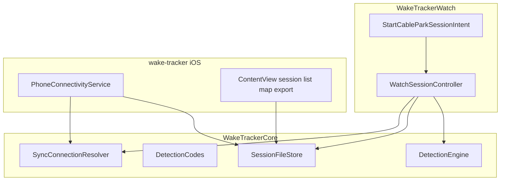
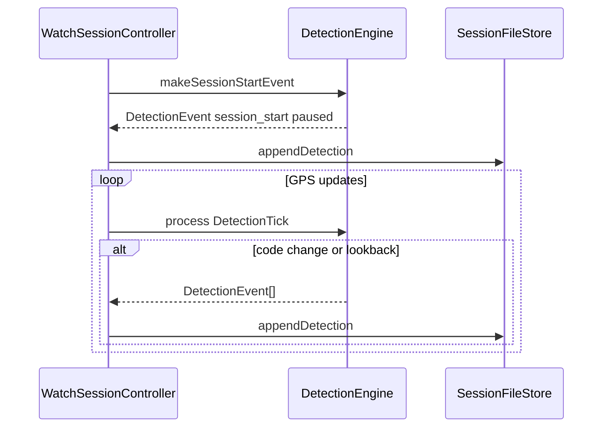

# System design

How Watch, iPhone, and `WakeTrackerCore` fit together. Library internals (DetectionEngine UML, store types): [../WakeTrackerCore/DESIGN.md](../WakeTrackerCore/DESIGN.md). Product lock: [../README.md](../README.md).

## Layers

| Layer | Own | Avoid |
|-------|-----|--------|
| `WakeTrackerCore` | Models, schema, file store, DetectionEngine, sync *wording* resolvers | UIKit/SwiftUI, WCSession, HealthKit, CoreLocation |
| `WakeTrackerWatch` | `HKWorkoutSession` dry-run, sensors, StartWorkoutIntent, WC send, thin probes into Core | Business decision trees that can be pure functions |
| `wake-tracker` | Permissions, WC receive/ack, session list/map/export | Session engine, label editing |

Apps read live `WCSession` / sensors, then call Core. Do not duplicate detection or sync decision trees in both targets.

## Detection stream

- **Detections:** `detections.jsonl` (transitions + `session_start` + lookback revisions; km/h `reason`).
- Codes: `riding` / `paused` / `unsure`.
- Manual labels removed.

Streams detail: [DataCollection.md](DataCollection.md). Thresholds: [Phase3.md](Phase3.md).
