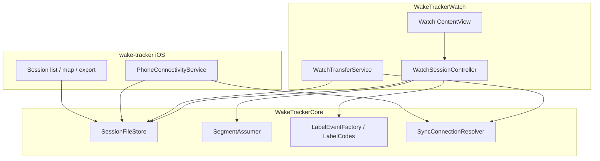
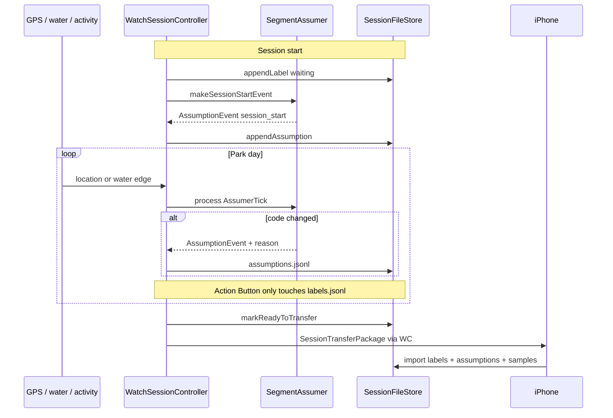

# System design

How Watch, iPhone, and `WakeTrackerCore` fit together. Library internals (Assumer UML, store types): [../WakeTrackerCore/DESIGN.md](../WakeTrackerCore/DESIGN.md). Product lock: [../README.md](../README.md).

## Layers

| Layer | Owns | Avoids |
|-------|------|--------|
| `WakeTrackerCore` | Models, schema, file store, Assumer FSM, label factory, sync *wording* resolvers | UIKit/SwiftUI, WCSession, HealthKit, CoreLocation |
| `WakeTrackerWatch` | `HKWorkoutSession` dry-run, sensors, Action Button, WC send, thin probes into Core | Business decision trees that can be pure functions |
| `wake-tracker` (iOS) | Permissions, WC receive/ack, session list/map/export | Label editing (Phase 2), session engine |

Apps read live `WCSession` / sensors, then call Core. Do not duplicate Assumer or sync decision trees in both targets.

## Dual-label corpus flow

Manual Action Button labels and auto assumptions are **independent** tracks (corpus mode). Join offline by timestamp.

- **Ground truth:** `labels.jsonl` (Action Button / Cycle label).
- **Assumptions:** `assumptions.jsonl` (transitions + `session_start`; km/h `reason`).
- Watch UI: manual code primary; assumed code secondary (debug).
- Phone: list both; Share export includes `assumptions`.

Algorithm thresholds and rule list: [Phase3.md](Phase3.md) · Core UML: [../WakeTrackerCore/DESIGN.md](../WakeTrackerCore/DESIGN.md).

## Hard constraints (unchanged)

1. HealthKit dry-run — no `finishWorkout()` / Health save; still mirror HR/energy into JSONL.
2. Never delete Watch session files until phone ack.
3. One continuous session per park day; no pause.
4. Label codes stay opaque strings.
5. iPhone Phase 2 view-only — no label editor.
6. OS floor iOS 26+ / watchOS 26+.
7. Water Lock on session start.
