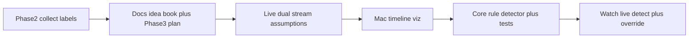

# Phase 3 — Auto-detection roadmap

Library UML (Assumer filter / holds / rules): [../RpplCore/DESIGN.md](../RpplCore/DESIGN.md). System dual-stream sequence: [DESIGN.md](DESIGN.md).

## Goal

Propose segment labels from GPS speed + Ultra water submersion (+ weak CMMotionActivity) so testers need fewer Action Button presses later. Manual override always wins for UX; for corpus collection, tracks stay **independent**. Labels stay opaque strings (`waiting`, `riding`, `swimming`, `walking`, …).

## Dual streams (live now)

During a Watch session:

| Stream | Source | File |
|--------|--------|------|
| Manual ground truth | Action Button / Cycle label | `labels.jsonl` |
| Auto assumptions | `SegmentAssumer` transitions | `assumptions.jsonl` |

- Assumer starts with `waiting` + `reason=session_start`.
- Writes **only on code change** (no heartbeats).
- Each `AssumptionEvent` has a `reason` string with rule id + speeds in **km/h**.
- Watch UI: manual code primary; assumed code secondary (debug mirror).
- Phone: list assumptions; Share JSON includes `assumptions` array.
- Action Button never resyncs Assumer state.

Pure FSM: `RpplCore` (`SegmentAssumer`, `AssumptionThresholds`, `SpeedUnits`). Covered by `swift test`.

## ASSUMPTION thresholds (v0, km/h)

| Constant | Value | Notes |
|----------|-------|-------|
| Ride enter | ≥15 km/h × 2.0 s | Below typical cable >22; above walk/swim ceiling 10 |
| Swim (Ultra) | `submerged` AND ≤10 km/h (or nil speed) | No speed-only swim |
| Failed start | Ride age <5 s, ≤4 km/h, not submerged → `waiting` | |
| Long stop | Ride age ≥5 s, ≤4 km/h × 3 s, not submerged → `waiting` | End-of-run without fall |
| Walk | activity `walking` OR 2–10 km/h × 3 s | |
| Wait settle | ≤1.5 km/h × 5 s, activity ≠ walking | |
| GPS accuracy gate | >25 m skips speed transitions | Water→swim still OK |

Non-Ultra auto-swim deferred. Knots/mph later for display only.

## Input

iPhone Share export is pretty-printed `SessionTransferPackage` JSON (`manifest`, `labels`, `assumptions`, `locations`, plus motion/health when present).

- `LocationSample` / `GPSSnapshot.speed` — meters per second (nil when invalid).
- `LabelEvent` — manual ground truth.
- `AssumptionEvent` — auto proposal + `reason`.
- Streams detail: [DataCollection.md](DataCollection.md). Hypotheses: [Ideas.md](Ideas.md).

## Order

**Done this slice:** Core Assumer + live Watch writer + phone list/export (corpus dual stream). Manual still primary UX.

**Next:** Mac timeline viz with manual + assumed lanes and threshold scrubbers. Then tighten constants / optional live override UX.

## Step A — Mac timeline viz (next code)

New macOS app/target in this repo (or SPM tool + SwiftUI Mac).

- Open exported session JSON or dropped session folder.
- Timeline: speed vs time, **manual** label markers, **assumed** markers, map track.
- Editable threshold scrubbers.
- Keep chart/data-prep separable for Core / iOS reuse.

## Step B — Synth / real fixtures

- Synth ticks already in `RpplCoreTests` (`SegmentAssumerTests`).
- **Real exports:** drop into `Exports/` (gitignored). Do not commit private park GPS without consent.

## Step C — Core detector

`SegmentAssumer` shipped as v0. Expand fixtures as park days land. Opaque string codes only.

## Step D — Live Watch (corpus mode shipped)

Feed Assumer from live GPS + water-edge ticks. Assumed code on face is debug-only. Full “override wins / fewer presses” UX still later — today tracks stay independent for tuning.

## Non-goals (Phase 3)

- Park profiles / dock geofence hardcoding ([Ideas.md](Ideas.md) Deferred)
- Trick detection / full taxonomy
- CloudKit
- Phone label editor
- ML models
- Non-Ultra speed-only auto-`swimming`
