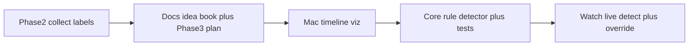

# Phase 3 — Auto-detection roadmap

Docs-only plan. No Mac target, detector Swift, or Xcode scheme in this pass. Implement Steps A–D only when explicitly requested.

## Goal

Propose segment labels from GPS speed (and later motion) so testers need fewer Action Button presses. Manual override always wins. Labels stay opaque strings (`waiting`, `riding`, `swimming`, `walking`, …).

## Input

iPhone Share export is a pretty-printed `SessionPackage` JSON (`manifest`, `labels`, `locations`, plus motion/health when present). On-disk sessions use the same models via `SessionFileStore` / `Models` in `WakeTrackerCore`.

- `LocationSample` / `GPSSnapshot.speed` — meters per second (nil when invalid).
- `LabelEvent` — manual ground truth for tuning (`code`, `timestamp`, optional GPS snapshot).
- Streams detail: [DataCollection.md](DataCollection.md). Hypotheses backlog: [Ideas.md](Ideas.md).

## Order

Manual labels = ground truth. Viz makes starts / falls / water-start reverts visible before freezing thresholds in Core. Blind constants with no files waste time.

## Step A — Mac timeline viz (first code later)

New macOS app/target in this repo (or SPM tool + SwiftUI Mac).

- Open exported session JSON or dropped session folder.
- Timeline: speed vs time, label markers, map track.
- Editable threshold scrubbers (e.g. start ~0 → ≥20 km/h for N seconds, fall → ~0, short spike = failed start).
- Optional export of annotated notes for fixture curation.
- Keep chart/data-prep separable so logic can later move into Core or a shared module for iOS reuse.

## Step B — Synth / real fixtures

- **No park day yet:** small labeled fixtures under `WakeTrackerCore/Tests/.../Fixtures/` encoding start, failed start, fall → swim, water-start revert, walk.
- **Real exports:** drop into `Exports/` (gitignored) and open in viz. Do not commit private park GPS without consent.

## Step C — Core detector

Pure functions in `WakeTrackerCore` (speed-window features → proposed `LabelEvent`s). Cover with `swift test` against fixtures. Opaque string codes only — no closed taxonomy enum. See detection table in [Ideas.md](Ideas.md).

## Step D — Live Watch

Feed detector from live GPS during an active session. Action Button / Cycle Label override wins. Still HealthKit dry-run: **do not `finishWorkout()`**.

## Non-goals (Phase 3)

- Park profiles / dock geofence hardcoding ([Ideas.md](Ideas.md) Deferred)
- Trick detection / full taxonomy
- CloudKit
- Phone label editor
- ML models

## After this docs pass

When ready for code: implement Step A (Mac viz) as its own task. Keep Core detector behind viz plus at least synth fixtures.
