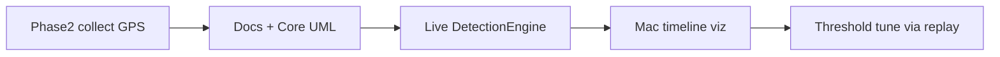

# Phase 3 — Auto-detection roadmap

Library UML (filter / holds / detectors): [../RpplCore/DESIGN.md](../RpplCore/DESIGN.md). System map: [DESIGN.md](DESIGN.md).

## Goal

Detect **rides** and **pauses** from GPS speed in real time so testers need no Action Button labeling. Codes stay opaque strings (`riding`, `inactive`, `unsure`).

## Detection stream (live now)

| Stream | Source | File |
|--------|--------|------|
| Auto detections | `DetectionEngine` transitions + lookback | `detections.jsonl` |

- Starts with `inactive` + `reason=session_start`.
- Writes **only on code change** / revision (no heartbeats).
- Each `DetectionEvent` has `detectorId` + `reason` (speeds in **km/h**) and optional `supersedesId`.
- Watch UI: last confident `riding`/`inactive` primary; `unsure` sublabel when soft GPS.
- Phone: list detections; Share JSON includes `detections`.
- Manual labels / Cycle Label removed.

Pure engine: `RpplCore` (`DetectionEngine`, `DetectionThresholds`, `SpeedUnits`). Covered by `swift test` including `replay`.

## Detection thresholds (v1, km/h)

| Constant | Value | Notes |
|----------|-------|-------|
| Ride enter | ≥20 km/h × 3.0 s | From `inactive` (4.0 s if highSpeed started from ≤8 km/h walk) |
| Ride exit | ≤4 km/h × 3.0 s | Usable GPS only |
| GPS gap → unsure | unusable × 3.0 s while riding | Not immediate pause |
| Same-ride merge | unsure age &lt; 60 s | Lookback supersede if speed returns high |
| Unsure timeout | ≥60 s | Force `inactive` → next enter is new ride |
| Water exit | logged only | Ultra submerged no longer ends rides (DCSBL-26) |
| GPS accuracy gate | >25 m skips speed | |
| Implausible / jump | >80 km/h / ≥30 km/h jump | |

Motion activity logged on ticks; unused by detectors. Non-Ultra uses GPS gap path (no water).

## Input

iPhone Share export is pretty-printed `SessionTransferPackage` JSON (`manifest`, `detections`, `locations`, plus motion/health/water/derived when present). Payload shape: [DataCollection.md](DataCollection.md#export). Policy: [LEGAL.md](../LEGAL.md).

## Order

**Done this slice:** Core detectors + live Watch writer + phone list/export + offline replay + schema v3.

**Next:** Mac timeline viz with detections lane and threshold scrubbers. Then ride-length / rounds metrics.

## Non-goals (Phase 3)

- Park profiles / dock geofence hardcoding ([Ideas.md](Ideas.md) Deferred)
- Trick detection / full taxonomy
- Manual Action Button labeling
- CloudKit
- Phone label editor
- ML models
- Water-required auto-swim
