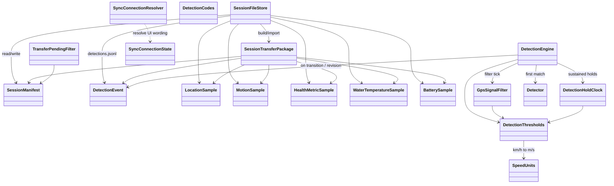
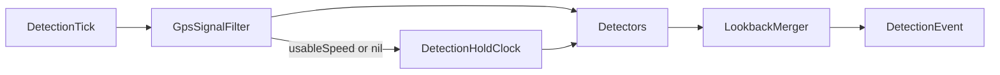
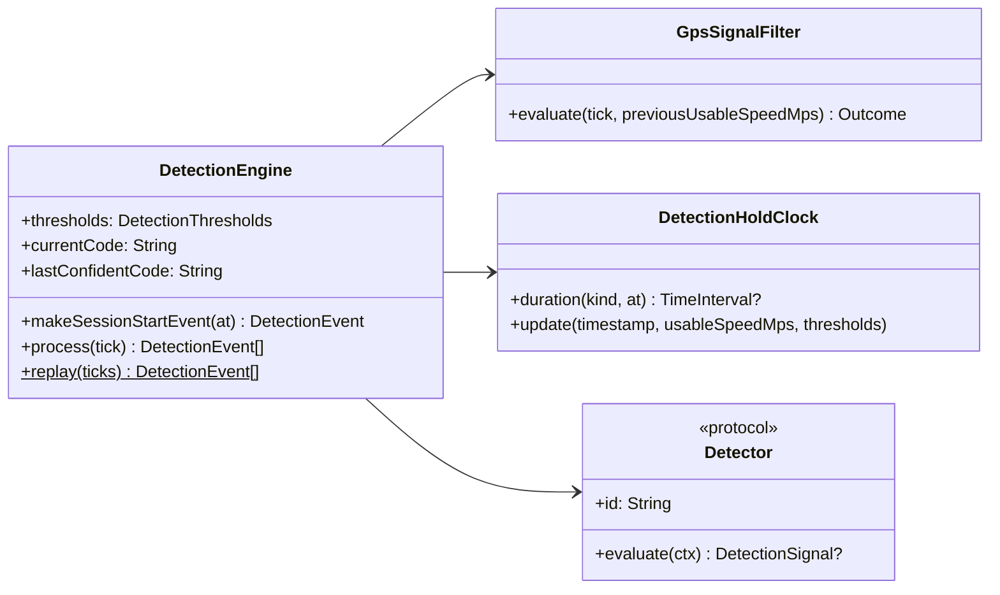

# RpplCore — design

Pure Swift package: models, session IO, sync resolvers, and the **DetectionEngine** (filter → holds → detectors → lookback). No UIKit/SwiftUI, WCSession, HealthKit, or CoreLocation. Covered by `swift test`.

Product defaults: [../CONTRIBUTING.md](../CONTRIBUTING.md) · streams: [../Docs/DataCollection.md](../Docs/DataCollection.md) · storage: [../Docs/SessionStorage.md](../Docs/SessionStorage.md) · detection: [../Docs/RideDetection.md](../Docs/RideDetection.md) · system map: [../Docs/DESIGN.md](../Docs/DESIGN.md).

## Module map



| Area | Types | Role |
|------|--------|------|
| Session IO | `SessionFileStore`, `SessionManifest`, `SessionTransferPackage` | Checkpoint JSONL + WC/Share package (`water-000.jsonl` / `battery-000.jsonl` optional) |
| Detection | `DetectionEvent`, `DetectionTick`, `DetectionEngine`, filter/holds/detectors | Auto ride/pause stream |
| Sync copy | `SyncConnectionResolver`, `SyncConnectionState`, `TransferPendingFilter` | Paired/reachable wording + pending transfer filter |
| Units | `SpeedUnits`, `DetectionThresholds`, `TemperatureFormat` | Thresholds authored in **km/h**; GPS compare in m/s |
| Derived stats | `SessionStatsBuilder`, `DerivedSessionView`, `SessionAnalyzer`, `LiveSetTracker`, `LapSetTracker`, `LapThresholds`, `GeoDistance`, `DistanceFormat`, `LocationSpeedStats`, `HighlightAssigner` | Persist `derived/view.json`; rebuild when `SessionAnalyzer.version` stale ([SessionStorage.md](../Docs/SessionStorage.md)) |

Opaque detection **codes are strings** (`riding`, `inactive`, `unsure`). Unknown codes must round-trip.

## Source folders

| Folder | Contents |
|--------|----------|
| `Detection/` | `DetectionEngine`, filter/holds/detectors, codes, thresholds, `SpeedUnits` |
| `Session/` | `SessionFileStore`, models, schema, `SessionLoader`, `StoreIO`, stats, `WorkoutMetadataKeys`, `TesterIdentity` |
| `Sync/` | `SyncConnectionResolver`, `SyncConnectionState`, `TransferPendingFilter` |
| `Geo/` | `GeoDistance`, downsample/centroid, map fit, location speed stats |
| `Format/` | Distance, duration, energy, temperature, byte-size formatters |
| *(root)* | `LiveSetTracker`, `LapSetTracker`, `HighlightAssigner`, `AppConstants`, `WakeLog` |

`SessionLoader.load(store:sessionId:)` bundles manifest, detections, locations, health, water, and derived stats for logbook detail (off-main reads via `StoreIO`). Geocoding stays in iPhone `Logbook/`.

## Session stats (derived)

`SessionStatsBuilder.build(manifest:detections:locations:health:water:)` resolves superseded detection lines, treats `unsure` as inactive for set windows (lookback supersede restores one set), sums haversine meters on set intervals only (accuracy + max-step + implied-speed gates), and reads cumulative active/basal calories as max HK mirror values (total = active + basal when both present). Water temperature is the mean of all persisted `WaterTemperatureSample`s; `SessionStats.waterTemperatureAvailable` copies `manifest.waterTemperatureAvailable` (missing/false → hide the tile; true with no samples → `- C`). Per set it also fills `sustainedSpeedKmh` (best mean over ≥5 usable GPS samples spanning ≥5 s; fallback mean of ≥2 usable), `averageSpeedKmh` (path distance/duration after trimming ≤4 km/h start/end tails), `peakSpeedKmh` (max usable GPS sample), and `fallDetected` (`FallDetector`: GPS speed collapses ≥15 km/h within 2.5 s from ≥15 km/h — a fall or hard letting-go, not a controlled stop). Session `maxSpeedKmh` is the max set peak; `averageSpeedKmh` is set meters / riding duration; `fallCount` sums flagged sets. `HighlightAssigner` then stamps set badges (`longest`, `longestTime` hidden when same as longest, `shortest` from 3 sets up and hidden when same as longest, `fastest`) and, across the logbook catalog, session badges (`longest` wall clock, `mostWaterTime` hidden when same session, `mostLaps`, `mostFalls`). `shortest` waits for 3 sets because with two it only names the other one, and it is only honest now that `failed_start` revokes a dock spike that would otherwise win it. `LiveSetTracker` mirrors set count / meters / riding duration on Watch during recording (meters only while confidently `riding`).

### Fall detection (`FallDetector`)

Not a detection code and not fed by accelerometer/motion data — Watch does not feed raw `MotionSample`s into `DetectionEngine` live ticks yet (only an optional `motionActivity` string, logged not decided on). `FallDetector.detectsFall` is a post-hoc GPS-only heuristic over a set's already-filtered locations (same `GpsSignalFilter` gates as `LocationSpeedStats`), with two rules: a **cliff** (speed collapses ≥15 km/h within 2.5 s from ≥15 km/h) and a **blackout** (cable speed ≥15 km/h immediately followed by a GPS silence ≥3 s that resumes at ≤8 km/h — a fall often kills the fix entirely, so the cliff itself is never sampled, only the gap is). Calibrated against `Fixtures/Detection` (every fixture set that ends by falling with continuous fixes shows the cliff; the one that ends through a GPS gap and resumes fast is left unflagged) and `Fixtures/FallDetection` (a real park-day recording: one set holds cable speed, loses GPS for 4 s, resumes near-stopped — only the blackout rule catches it; five more sets show plain cliffs; two sets with a gradual, fully-sampled decel are left unflagged as controlled stops). No fixture captures a controlled dock landing closely enough to fully validate the negative case, so treat this as tuned on falls, not a validated soft-stop classifier — see `FallDetector.swift` doc comment before changing the thresholds.

### Laps (crossing-based)

`LapSetTracker` counts assumed start crossings per set: leave beyond `exitRadiusM`, travel ≥ `minPathBeforeCrossingM`, re-enter `startSafeRadiusM` → +1. Injectable `LapThresholds` (defaults: safe 50 m / exit 70 m / min path 200 m). Bad GPS ignored via `GeoDistance.acceptsStep`. Scoring only after a prior pause (mid-ride session start skipped). FSM runs only while attributed riding; pause freezes the count. `SetSegmentStats.lapCount` lives in derived `view.json` only (raw GPS + detections regenerate it). Decode accepts intermediate slang mis-key `setCount`. Same tracker powers offline stats and live Watch UI. Do not call these crossings “sets” — see AGENTS Set vs lap.

## Detection pipeline

Watch feeds `DetectionTick` (speed m/s, accuracy, optional water/activity). Core never imports CoreLocation / CoreMotion.



1. **Filter** — drop flaky GPS for *speed* rules (nil speed, accuracy &lt; 0 or &gt; 25 m, implausible &gt; 80 km/h, jump ≥ 30 km/h vs last usable).
2. **Hold clock** — `highSpeed`, `stopped`, `unusable`.
3. **Lookback** — while `unsure`, usable fast within 60 s supersedes same ride; usable slow → inactive; ≥ 60 s → timeout to inactive (new set later).
4. **Detectors** — ordered plugins; first match wins (`unsure_timeout`, `gps_gap`, `ride_exit`, `ride_enter`).

Session start: `makeSessionStartEvent()` → `inactive` + `reason=session_start`.

### Extending

| Goal | Do this |
|------|---------|
| Tighter GPS filter | Adjust `DetectionThresholds` or replace `GpsSignalFilter` |
| New sustained signal | Add `DetectionHoldKind` + predicate |
| New behaviour | New `Detector` struct; prepend/append on `DetectionEngine` init |
| Offline experiment | `DetectionEngine.replay(ticks:)` or `replay(locations:)` |

### Class detail



MVP detectors: `RideEnterDetector`, `RideExitDetector`, `GpsGapDetector`, `UnsureTimeoutDetector`.

## On-disk session layout

```
<root>/<sessionId>/
  manifest.json
  detections.jsonl      # DetectionEvent (transitions + revisions)
  location-000.jsonl
  motion-000.jsonl.zlib
  health-000.jsonl
```

`SessionTransferPackage` carries `detections` (legacy `assumptions` → detections; `labels` discarded).

## Tests

```bash
cd RpplCore && swift test
```

Suites cover store/transfer, detection scenarios, GPS filter noise, detector extensibility, and offline replay.
