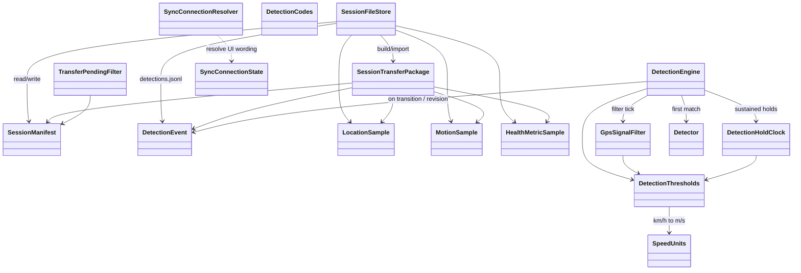
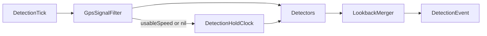
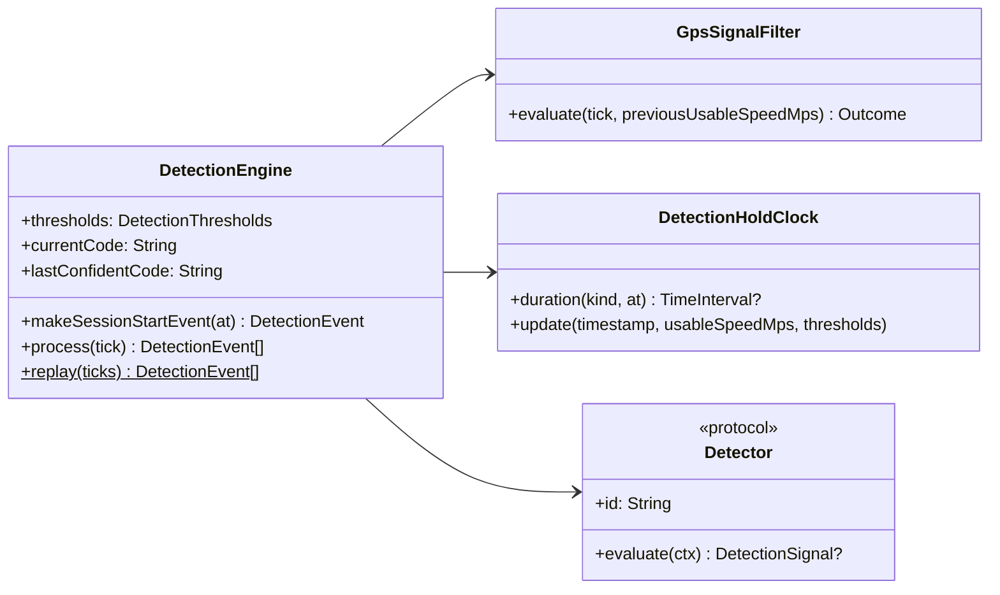

# RpplCore — design

Pure Swift package: models, session IO, sync resolvers, and the **DetectionEngine** (filter → holds → detectors → lookback). No UIKit/SwiftUI, WCSession, HealthKit, or CoreLocation. Covered by `swift test`.

Product context: [../README.md](../README.md) · streams: [../Docs/DataCollection.md](../Docs/DataCollection.md) · Phase 3: [../Docs/Phase3.md](../Docs/Phase3.md) · system map: [../Docs/DESIGN.md](../Docs/DESIGN.md).

## Module map



| Area | Types | Role |
|------|--------|------|
| Session IO | `SessionFileStore`, `SessionManifest`, `SessionTransferPackage` | Checkpoint JSONL + WC/Share package |
| Detection | `DetectionEvent`, `DetectionTick`, `DetectionEngine`, filter/holds/detectors | Auto ride/pause stream |
| Sync copy | `SyncConnectionResolver`, `SyncConnectionState`, `TransferPendingFilter` | Paired/reachable wording + pending transfer filter |
| Units | `SpeedUnits`, `DetectionThresholds` | Thresholds authored in **km/h**; GPS compare in m/s |
| Derived stats | `SessionStatsBuilder`, `LiveRideTracker`, `LapRideTracker`, `LapThresholds`, `GeoDistance`, `DistanceFormat`, `LocationSpeedStats`, `HighlightAssigner` | Recomputed from detections + GPS + health; not persisted |

Opaque detection **codes are strings** (`riding`, `inactive`, `unsure`). Unknown codes must round-trip.

## Session stats (derived)

`SessionStatsBuilder.build(manifest:detections:locations:health:)` resolves superseded detection lines, treats `unsure` as inactive for ride windows (lookback supersede restores one ride), sums haversine meters on ride intervals only (accuracy + max-step + implied-speed gates), and reads cumulative active/basal calories as max HK mirror values (total = active + basal when both present). Per ride it also fills `sustainedSpeedKmh` (best mean over ≥5 usable GPS samples spanning ≥5 s; fallback mean of ≥2 usable) and `averageSpeedKmh` (path distance/duration after trimming ≤4 km/h start/end tails). `HighlightAssigner` then stamps ride badges (`longest`, `longestTime` hidden when same as longest, `fastest`) and, across the logbook catalog, session badges (`longest` wall clock, `mostWaterTime` hidden when same session, `mostLaps`). Shortest ride badge deferred until failed-start detection improves. `LiveRideTracker` mirrors ride count / meters on Watch during recording (meters only while confidently `riding`).

### Laps (crossing-based)

`LapRideTracker` counts assumed start crossings per ride: leave beyond `exitRadiusM`, travel ≥ `minPathBeforeCrossingM`, re-enter `startSafeRadiusM` → +1. Injectable `LapThresholds` (defaults: safe 50 m / exit 70 m / min path 200 m). Bad GPS ignored via `GeoDistance.acceptsStep`. Scoring only after a prior pause (mid-ride session start skipped). FSM runs only while attributed riding; pause freezes the count. `RideSegmentStats.lapCount` is derived only (not persisted). Same tracker powers offline stats and live Watch UI.

## Detection pipeline

Watch feeds `DetectionTick` (speed m/s, accuracy, optional water/activity). Core never imports CoreLocation / CoreMotion.



1. **Filter** — drop flaky GPS for *speed* rules (nil speed, accuracy &lt; 0 or &gt; 25 m, implausible &gt; 45 km/h, jump ≥ 30 km/h vs last usable).
2. **Hold clock** — `highSpeed`, `stopped`, `unusable`.
3. **Lookback** — while `unsure`, usable fast within 60 s supersedes same ride; usable slow → inactive; ≥ 60 s → timeout to inactive (new ride later). Ultra `submerged` → inactive via `water_exit`.
4. **Detectors** — ordered plugins; first match wins (`unsure_timeout`, `water_exit`, `gps_gap`, `ride_exit`, `ride_enter`).

Session start: `makeSessionStartEvent()` → `inactive` + `reason=session_start`.

### Extending

| Goal | Do this |
|------|---------|
| Tighter GPS filter | Adjust `DetectionThresholds` or replace `GpsSignalFilter` |
| New sustained signal | Add `DetectionHoldKind` + predicate |
| New behaviour | New `Detector` struct; prepend/append on `DetectionEngine` init |
| Offline experiment | `DetectionEngine.replay(ticks:)` or `replay(locations:)` |

### Class detail



MVP detectors: `RideEnterDetector`, `RideExitDetector`, `GpsGapDetector`, `UnsureTimeoutDetector`.

## On-disk session layout

```
<root>/<sessionId>/
  manifest.json
  detections.jsonl      # DetectionEvent (transitions + revisions)
  location-000.jsonl
  motion-000.jsonl.zlib
  health-000.jsonl
```

`SessionTransferPackage` carries `detections` (legacy `assumptions` → detections; `labels` discarded).

## Tests

```bash
cd RpplCore && swift test
```

Suites cover store/transfer, detection scenarios, GPS filter noise, detector extensibility, and offline replay.
