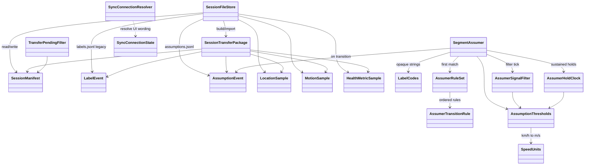
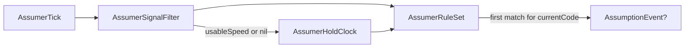
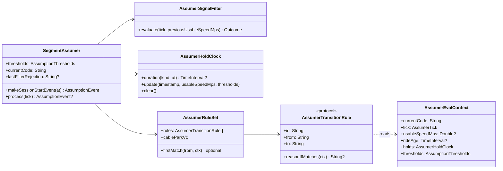

# RpplCore — design

Pure Swift package: models, session IO, sync resolvers, and the **segment Assumer** FSM. No UIKit/SwiftUI, WCSession, HealthKit, or CoreLocation. Covered by `swift test`.

Product context: [../README.md](../README.md) · streams: [../Docs/DataCollection.md](../Docs/DataCollection.md) · Phase 3: [../Docs/Phase3.md](../Docs/Phase3.md) · system map: [../Docs/DESIGN.md](../Docs/DESIGN.md).

## Module map



| Area | Types | Role |
|------|--------|------|
| Session IO | `SessionFileStore`, `SessionManifest`, `SessionTransferPackage` | Checkpoint JSONL + WC/Share package |
| Segment codes | `LabelCodes`, legacy `LabelEvent` | Opaque strings; `LabelEvent` for old packages |
| Assumptions | `AssumptionEvent`, `AssumerTick`, `SegmentAssumer`, filter/holds/rules | Live Assumer stream |
| Sync copy | `SyncConnectionResolver`, `SyncConnectionState`, `TransferPendingFilter` | Paired/reachable wording + pending transfer filter |
| Units | `SpeedUnits`, `AssumptionThresholds` | Thresholds authored in **km/h**; GPS compare in m/s |

Opaque label **codes are strings** (`waiting`, `riding`, …). Unknown codes must round-trip. No closed taxonomy enum yet.

## Assumer pipeline

Watch feeds `AssumerTick` (speed m/s, accuracy, water state, motion activity). Core never imports CoreLocation / CoreMotion — apps map Apple types into ticks.



1. **Filter** — drop flaky GPS for *speed* rules (nil speed, accuracy &lt; 0 or &gt; 25 m, implausible &gt; 45 km/h, jump ≥ 30 km/h vs last usable). Water/activity still available on the raw tick (Ultra swim can fire when speed is filtered).
2. **Hold clock** — named sustained predicates (`highSpeed`, `stopped`, `walkBand`, `waitSettle`). Bad/missing usable speed clears holds.
3. **Rule set** — ordered `AssumerTransitionRule` list; first match for `currentCode` wins. Emit `AssumptionEvent` with km/h `reason` string.

Session start: `makeSessionStartEvent()` → `waiting` + `reason=session_start`.

### Extending

| Goal | Do this |
|------|---------|
| Tighter GPS filter | Adjust `AssumptionThresholds` or replace `AssumerSignalFilter` |
| New sustained signal | Add `AssumerHoldKind` + predicate in `AssumerHoldClock.update` |
| New behaviour / edge | New `AssumerTransitionRule` struct; append or prepend on `AssumerRuleSet` |
| Custom corpus experiment | `SegmentAssumer(rules: AssumerRuleSet(rules: [...]))` |

Default rules: `AssumerRuleSet.cableParkV0` (see [Docs/Phase3.md](../Docs/Phase3.md) threshold table).

### Class detail (Assumer)



Concrete v0 rules (examples): `RideStartRule`, `FallSwimRule`, `FailedStartRule`, `LongStopRule`, `WaterStartRule`, `WalkFromWaitingRule`, `WalkFromSwimmingRule`, `WaitSettleRule`.

## On-disk session layout

```
<root>/<sessionId>/
  manifest.json
  labels.jsonl          # legacy LabelEvent (empty on new sessions)
  assumptions.jsonl     # AssumptionEvent (transitions only)
  location-000.jsonl
  motion-000.jsonl.zlib # framed zlib JSONL (legacy plain .jsonl still readable)
  health-000.jsonl
```

`SessionTransferPackage` carries `assumptions` (decode-missing → `[]` for legacy exports) and `motionFramesZlib` when motion was recorded compressed.

## Tests

```bash
cd RpplCore && swift test
```

Suites cover store/transfer, Assumer scenarios, signal filter noise, and rule-set extensibility (custom rule prepend).
