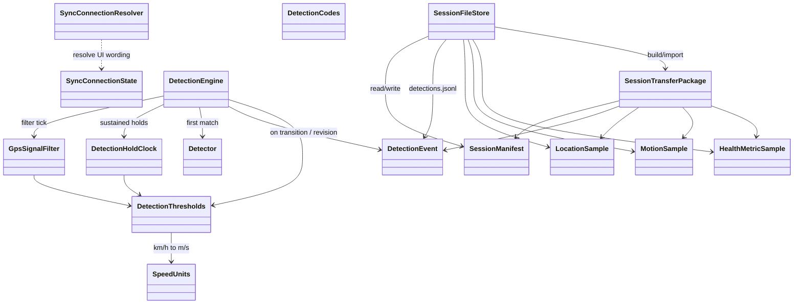
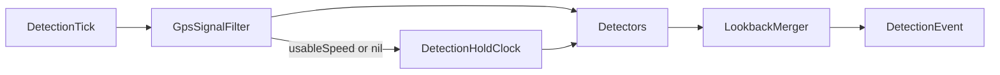
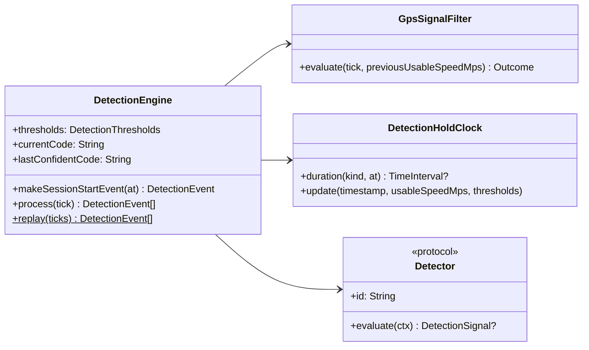

# WakeTrackerCore — design

Pure Swift package: models, session IO, sync resolvers, and the **DetectionEngine** (filter → holds → detectors → lookback). No UIKit/SwiftUI, WCSession, HealthKit, or CoreLocation. Covered by `swift test`.

Product context: [../README.md](../README.md) · streams: [../Docs/DataCollection.md](../Docs/DataCollection.md) · Phase 3: [../Docs/Phase3.md](../Docs/Phase3.md) · system map: [../Docs/DESIGN.md](../Docs/DESIGN.md).

## Module map



| Area | Types | Role |
|------|--------|------|
| Session IO | `SessionFileStore`, `SessionManifest`, `SessionTransferPackage` | Checkpoint JSONL + WC/Share package |
| Detection | `DetectionEvent`, `DetectionTick`, `DetectionEngine`, filter/holds/detectors | Auto ride/pause stream |
| Sync copy | `SyncConnectionResolver`, `SyncConnectionState` | Paired/reachable wording |
| Units | `SpeedUnits`, `DetectionThresholds` | Thresholds authored in **km/h**; GPS compare in m/s |

Opaque detection **codes are strings** (`riding`, `paused`, `unsure`). Unknown codes must round-trip.

## Detection pipeline

Watch feeds `DetectionTick` (speed m/s, accuracy, optional water/activity). Core never imports CoreLocation / CoreMotion.



1. **Filter** — drop flaky GPS for *speed* rules (nil speed, accuracy &lt; 0 or &gt; 25 m, implausible &gt; 45 km/h, jump ≥ 30 km/h vs last usable).
2. **Hold clock** — `highSpeed`, `stopped`, `unusable`.
3. **Lookback** — while `unsure`, usable fast within 3 min supersedes same ride; usable slow → paused; ≥ 3 min → timeout to paused (new ride later).
4. **Detectors** — ordered plugins; first match wins (`unsure_timeout`, `gps_gap`, `ride_exit`, `ride_enter`).

Session start: `makeSessionStartEvent()` → `paused` + `reason=session_start`.

### Extending

| Goal | Do this |
|------|---------|
| Tighter GPS filter | Adjust `DetectionThresholds` or replace `GpsSignalFilter` |
| New sustained signal | Add `DetectionHoldKind` + predicate |
| New behaviour | New `Detector` struct; prepend/append on `DetectionEngine` init |
| Offline experiment | `DetectionEngine.replay(ticks:)` or `replay(locations:)` |

### Class detail



MVP detectors: `RideEnterDetector`, `RideExitDetector`, `GpsGapDetector`, `UnsureTimeoutDetector`.

## On-disk session layout

```
<root>/<sessionId>/
  manifest.json
  detections.jsonl      # DetectionEvent (transitions + revisions)
  location-000.jsonl
  motion-000.jsonl.zlib
  health-000.jsonl
```

`SessionTransferPackage` carries `detections` (legacy `assumptions` → detections; `labels` discarded).

## Tests

```bash
cd WakeTrackerCore && swift test
```

Suites cover store/transfer, detection scenarios, GPS filter noise, detector extensibility, and offline replay.
